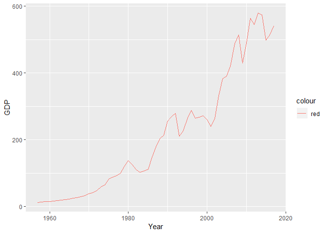

HW1
================
Oliver Ng
9 november 2018

Oliver Ng 8 november 2018

Föregående erfarenhet: Har använt R under 3 kurser, måttligt kunskap inom detta dock ingenting inom tidyverse package, mest lär sig med överdrivet användning av google.

Testa att göra en plot över Sveriges GDP

``` r
library(tidyverse)
```

    ## -- Attaching packages -------------------------------------- tidyverse 1.2.1 --

    ## v ggplot2 3.0.0     v purrr   0.2.5
    ## v tibble  1.4.2     v dplyr   0.7.6
    ## v tidyr   0.8.1     v stringr 1.3.1
    ## v readr   1.1.1     v forcats 0.3.0

    ## -- Conflicts ----------------------------------------- tidyverse_conflicts() --
    ## x dplyr::filter() masks stats::filter()
    ## x dplyr::lag()    masks stats::lag()

``` r
library(ggplot2)

GDP <- read.table("HW1_files.txt")

colnames(GDP) <- c("Year", "GDP")

head(GDP)
```

    ##   Year     GDP    NA
    ## 1 2017 540.000  2.1%
    ## 2 2016 514.460  2.7%
    ## 3 2015 498.118  4.5%
    ## 4 2014 574.413  2.6%
    ## 5 2013 579.361  1.2%
    ## 6 2012 544.482 -0.3%

``` r
ggplot(data = GDP, aes(Year, GDP, colour = "red")) + geom_line()
```



Började att hitta datan från <https://countryeconomy.com/gdp/sweden> och copy-paste det i GDP.txt

Sen tar vi bort gdp ökning per år och ta bort bokstäverna i antal gdp och byt tecknet , till . med find\_replace(vet) då det orsakade underligheter i plotten.

Därefter plotta den med koden och en rudimentär graf är given.

``` r
sessionInfo()
```

    ## R version 3.5.1 (2018-07-02)
    ## Platform: x86_64-w64-mingw32/x64 (64-bit)
    ## Running under: Windows 10 x64 (build 17134)
    ## 
    ## Matrix products: default
    ## 
    ## locale:
    ## [1] LC_COLLATE=Swedish_Sweden.1252  LC_CTYPE=Swedish_Sweden.1252   
    ## [3] LC_MONETARY=Swedish_Sweden.1252 LC_NUMERIC=C                   
    ## [5] LC_TIME=Swedish_Sweden.1252    
    ## 
    ## attached base packages:
    ## [1] stats     graphics  grDevices utils     datasets  methods   base     
    ## 
    ## other attached packages:
    ## [1] forcats_0.3.0   stringr_1.3.1   dplyr_0.7.6     purrr_0.2.5    
    ## [5] readr_1.1.1     tidyr_0.8.1     tibble_1.4.2    ggplot2_3.0.0  
    ## [9] tidyverse_1.2.1
    ## 
    ## loaded via a namespace (and not attached):
    ##  [1] Rcpp_0.12.19     cellranger_1.1.0 pillar_1.3.0     compiler_3.5.1  
    ##  [5] plyr_1.8.4       bindr_0.1.1      tools_3.5.1      digest_0.6.18   
    ##  [9] lubridate_1.7.4  jsonlite_1.5     evaluate_0.12    nlme_3.1-137    
    ## [13] gtable_0.2.0     lattice_0.20-35  pkgconfig_2.0.2  rlang_0.2.2     
    ## [17] cli_1.0.1        rstudioapi_0.8   yaml_2.2.0       haven_1.1.2     
    ## [21] bindrcpp_0.2.2   withr_2.1.2      xml2_1.2.0       httr_1.3.1      
    ## [25] knitr_1.20       hms_0.4.2        rprojroot_1.3-2  grid_3.5.1      
    ## [29] tidyselect_0.2.5 glue_1.3.0       R6_2.3.0         readxl_1.1.0    
    ## [33] rmarkdown_1.10   modelr_0.1.2     magrittr_1.5     backports_1.1.2 
    ## [37] scales_1.0.0     htmltools_0.3.6  rvest_0.3.2      assertthat_0.2.0
    ## [41] colorspace_1.3-2 labeling_0.3     stringi_1.1.7    lazyeval_0.2.1  
    ## [45] munsell_0.5.0    broom_0.5.0      crayon_1.3.4
